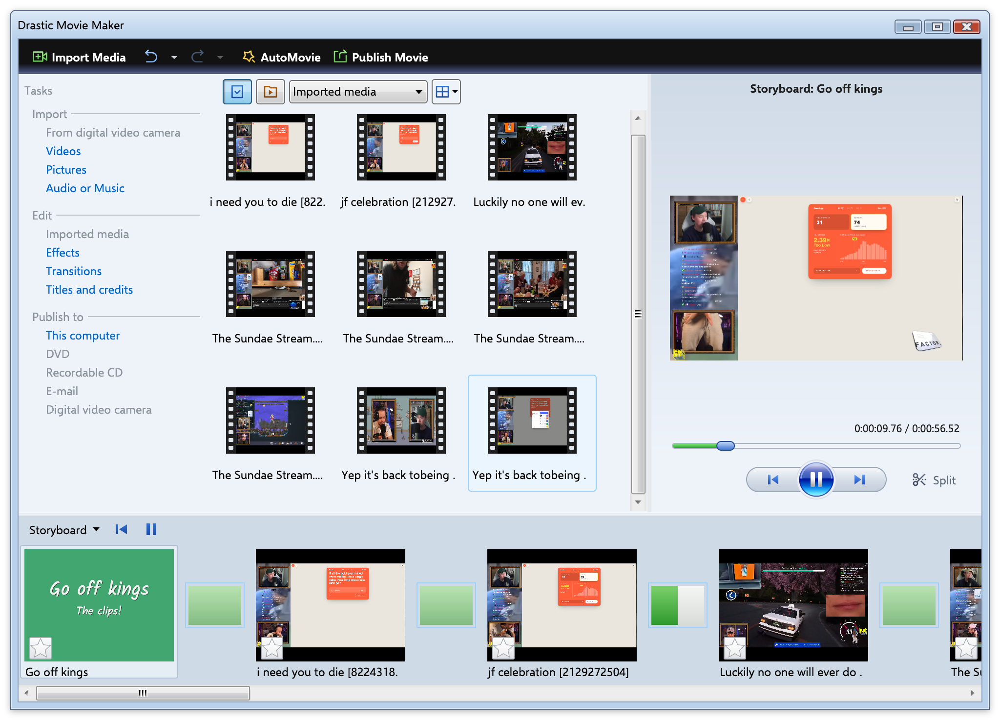

# Drastic Movie Maker

Drastic Movie Maker is an experimental video editor, written in .NET with Avalonia. It's modeled after the Windows Movie Maker for Windows Vista and Windows 7.

There are tons of video editing software out there, but they are mostly aimed at "content creators" with tons of features I don't need. Windows Movie Maker let you drag clips into a timeline and make a video, which is all I need. It was also a good way for me to try writing Skia filters and fix issues in [AvaWpf](https://github.com/drasticactions/AvaWpf).

While I tried to match the features within the later versions of Windows Movie Maker, it's _not_ a "Clean-Room Reimplmentation." It's mostly me eye-balling it and trying to match what the UI and features do. I did try to compare it with running similar clips in Windows Movie Maker to guess what it does, but don't assume it will match it. I'm not strictly trying to.

# macOS Gatekeeper

The current CI builds are not signed. To use them on macOS, you'll need to remove the quarantine on them.

- Extract the app from the DMG, either to `/Applications` or another location.
- Run `xattr -rd com.apple.quarantine /Applications/Drastic\ Movie\ Maker.app`, change the path with the location of the app.

It should then run.

# LLM Usage

I did use LLMs while working on this project.

- Tests and debugging were pushed through via Claude. Some of this was testing against Windows Vista and Windows 7 installs for the Windows Movie Maker project importer code I wrote, which could be harnessed to make it easier to compare my shaders and effects against the originals by running encodes against them.
- I wrote the majority of the backend and frontend code as I went. Some of it was edited or added by Claude while debugging through it, which I either accepted and didn't change, accepted and did change, or ignored and rewrote.
- The GitHub Actions and ffmpeg build scripts were generated via Claude.

